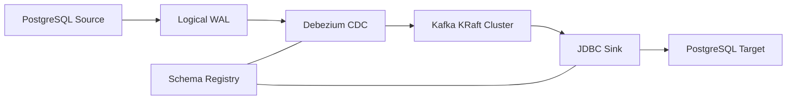

# PostgreSQL Kafka CDC Pipeline

A near-real-time Change Data Capture pipeline that replicates PostgreSQL row changes through Apache Kafka into another PostgreSQL database.

The pipeline captures initial data and subsequent `INSERT`, `UPDATE`, and `DELETE` operations using PostgreSQL WAL and Debezium. Events are serialized with Avro, registered in Schema Registry, and written idempotently to the target database using the Kafka Connect JDBC Sink.

## Architecture



```text
PostgreSQL Source
→ PostgreSQL Logical WAL
→ Debezium PostgreSQL Connector
→ Kafka Topic with Avro
→ JDBC Sink Connector
→ PostgreSQL Target
```

## Technology Stack

* PostgreSQL 16
* Apache Kafka in KRaft mode
* Confluent Platform 8.3.1
* Kafka Connect
* Debezium PostgreSQL Connector 3.1.2
* Confluent JDBC Connector 10.9.0
* Avro
* Schema Registry
* Docker Compose
* Confluent Control Center
* Prometheus and Alertmanager

## Project Features

* Three-node Kafka KRaft cluster
* Persistent Kafka broker storage
* PostgreSQL logical replication
* Debezium initial snapshot
* Near-real-time WAL-based CDC
* Avro key and value serialization
* Schema Registry integration
* JDBC Sink upsert
* Tombstone-based delete propagation
* Automatic target table creation and evolution
* Three-partition topic with replication factor three
* Persistent Kafka Connect configurations and offsets
* PostgreSQL initialization script
* Automatic `updated_at` trigger
* Dead Letter Queue configuration

## Repository Structure

```text
postgres-kafka-replicas/
├── connectors/
│   ├── postgres-cdc-source.example.json
│   └── postgres-target-sink.example.json
├── postgres/
│   └── source-init/
│       └── 001-init.sql
├── Dockerfile.connect
├── docker-compose.yml
├── .gitignore
└── README.md
```

Local connector configurations containing credentials use the `.local.json` suffix and are excluded from Git.

## Data Flow

Debezium first performs an initial snapshot of existing rows in the source table. Snapshot records use the operation code:

```text
__op = r
```

After the snapshot finishes, Debezium continuously reads PostgreSQL WAL changes:

| Database operation | Debezium operation            |
| ------------------ | ----------------------------- |
| Initial snapshot   | `r`                           |
| Insert             | `c`                           |
| Update             | `u`                           |
| Delete             | Tombstone with `value = null` |

The Kafka record key contains the PostgreSQL primary key:

```json
{"id": 14}
```

A delete is represented by a tombstone:

```text
Key   = {"id": 14}
Value = null
```

The JDBC Sink uses the Kafka record key as the target primary key. Insert and update events use upsert semantics, while tombstones delete the corresponding target row.

## Prerequisites

* Docker
* Docker Compose
* Git
* curl
* Python 3
* Optional: DBeaver or another PostgreSQL client

## Service Ports

| Service           | Host port |
| ----------------- | --------: |
| Kafka broker 1    |      9092 |
| Kafka broker 2    |      9094 |
| Kafka broker 3    |      9096 |
| Schema Registry   |      8081 |
| Kafka Connect     |      8083 |
| PostgreSQL source |      5432 |
| PostgreSQL target |      5433 |
| Control Center    |      9021 |
| Prometheus        |      9090 |
| Alertmanager      |      9093 |

Internal Docker connections use container hostnames instead of `localhost`.

Examples:

```text
postgres-source:5432
postgres-target:5432
broker:29092
schema-registry:8081
```

## Running the Project

Build the custom Kafka Connect image:

```bash
docker compose build --no-cache connect
```

Start the core pipeline:

```bash
docker compose up -d \
  broker broker-2 broker-3 \
  schema-registry \
  postgres-source postgres-target \
  connect
```

Check container status:

```bash
docker compose ps
```

## Kafka Persistence

Each broker uses a dedicated named volume mounted at:

```text
/var/lib/kafka/data
```

This preserves:

* Application topics
* Kafka Connect configuration topics
* Kafka Connect offset topics
* Kafka Connect status topics
* Schema Registry schemas
* Consumer group offsets

Persistence can be tested using:

```bash
docker compose stop
docker compose start
```

After restart, verify that connectors and topics remain available:

```bash
curl -s http://localhost:8083/connectors
```

```bash
docker exec broker kafka-topics \
  --bootstrap-server broker:29092 \
  --list
```

Do not use the following command unless all persisted data should be deleted:

```bash
docker compose down -v
```

## PostgreSQL Source Configuration

The source database uses:

```text
wal_level = logical
max_replication_slots = 10
max_wal_senders = 10
```

Verify the settings:

```bash
docker exec postgres-source \
  psql -U postgres -d source_db \
  -c "SHOW wal_level;" \
  -c "SHOW max_replication_slots;" \
  -c "SHOW max_wal_senders;"
```

The initialization script creates:

* `public.customers`
* Primary key on `id`
* Unique constraint on `email`
* Initial snapshot records
* Function to update `updated_at`
* `BEFORE UPDATE` trigger

Initialization scripts only run automatically when the PostgreSQL data directory is empty.

## Registering the Debezium Source

Create a local configuration from the example:

```bash
cp connectors/postgres-cdc-source.example.json \
   connectors/postgres-cdc-source.local.json
```

Replace the example credentials, then register the connector:

```bash
curl -X POST \
  -H "Content-Type: application/json" \
  --data @connectors/postgres-cdc-source.local.json \
  http://localhost:8083/connectors
```

Check its status:

```bash
curl -s \
  http://localhost:8083/connectors/postgres-cdc-source/status \
  | python3 -m json.tool
```

Both the connector and task should be `RUNNING`.

## Registering the JDBC Sink

Create a local configuration:

```bash
cp connectors/postgres-target-sink.example.json \
   connectors/postgres-target-sink.local.json
```

Replace the example credentials, then register the connector:

```bash
curl -X POST \
  -H "Content-Type: application/json" \
  --data @connectors/postgres-target-sink.local.json \
  http://localhost:8083/connectors
```

Check its status:

```bash
curl -s \
  http://localhost:8083/connectors/postgres-target-sink/status \
  | python3 -m json.tool
```

The sink uses:

```text
insert.mode = upsert
pk.mode = record_key
pk.fields = id
delete.enabled = true
auto.create = true
auto.evolve = true
```

## Kafka Topic

The CDC topic is:

```text
pg_source.public.customers
```

Inspect it:

```bash
docker exec broker kafka-topics \
  --bootstrap-server broker:29092 \
  --describe \
  --topic pg_source.public.customers
```

Expected configuration:

```text
PartitionCount: 3
ReplicationFactor: 3
```

## Reading Avro Events

```bash
docker exec -it schema-registry kafka-avro-console-consumer \
  --bootstrap-server broker:29092 \
  --property schema.registry.url=http://schema-registry:8081 \
  --topic pg_source.public.customers \
  --property print.key=true \
  --property print.value=true \
  --property key.separator=" | "
```

Registered subjects can be checked using:

```bash
curl -s http://localhost:8081/subjects \
  | python3 -m json.tool
```

Expected subjects:

```text
pg_source.public.customers-key
pg_source.public.customers-value
```

## Verified CRUD Scenario

### Create

An inserted source row produced:

```text
__op = c
```

The row was created in the target database.

### Read

Source and target queries returned identical values for:

```text
id
full_name
email
status
```

### Update

An update produced:

```text
__op = u
```

The target row was updated using upsert without creating a duplicate.

### Delete

A committed delete produced:

```text
{"id":14} | null
```

The JDBC Sink consumed the tombstone and deleted the corresponding target row.

The final result was:

```text
Source: 0 rows
Target: 0 rows
```

## Timestamp Handling

PostgreSQL `TIMESTAMPTZ` values are represented by Debezium as UTC strings.

For example:

```text
Source : 2026-09-01 15:06:37+07
Kafka  : 2026-09-01T08:06:37Z
```

Both values represent the same instant.

UTC is retained as the canonical event timezone. Local time should be applied at the query or presentation layer.

## Delivery Semantics

This pipeline provides:

```text
At-least-once delivery
```

It does not claim exactly-once end-to-end replication.

Possible duplicate events are handled through:

```text
Primary key + JDBC upsert
```

The target database is eventually consistent with the source and may temporarily lag behind it.

## Dead Letter Queue

The JDBC Sink is configured with:

```text
dlq.postgres-target
```

The DLQ topic uses replication factor three. DLQ failure injection and recovery testing are still pending.

## Current Progress

* [x] PostgreSQL source and target
* [x] Three-node Kafka KRaft cluster
* [x] Persistent Kafka broker volumes
* [x] Kafka Connect internal topic persistence
* [x] PostgreSQL logical WAL
* [x] Debezium PostgreSQL connector
* [x] Initial snapshot
* [x] Avro and Schema Registry
* [x] JDBC Sink
* [x] Upsert without duplicate rows
* [x] Tombstone-based delete
* [x] End-to-end CRUD verification
* [x] Automatic source `updated_at` trigger
* [x] Sink DLQ configuration
* [ ] DLQ failure injection and recovery
* [ ] Kafka Connect restart recovery test
* [ ] PostgreSQL restart recovery test
* [ ] Single-broker failure test
* [ ] Connector status monitoring
* [ ] Consumer lag monitoring
* [ ] Throughput monitoring
* [ ] Latency measurement
* [ ] Workload data generator
* [ ] Automated integration testing
* [ ] Final benchmark report

## Troubleshooting Notes

### Kafka Connect API initially returns an empty response

Kafka Connect may require additional startup time.

Check:

```bash
docker compose logs -f connect
```

Then retry:

```bash
curl http://localhost:8083/connectors
```

### Debezium plugin is not detected

Ensure the custom image uses a compatible Connect runtime:

```dockerfile
FROM confluentinc/cp-server-connect:8.3.1
```

Rebuild and recreate:

```bash
docker compose build --no-cache connect
docker compose up -d --force-recreate connect
```

### Avro rejects the namespace

Avro identifiers cannot contain hyphens. Use:

```text
pg_source
```

instead of:

```text
pg-source
```

### Delete does not appear in Kafka

Debezium only processes committed transactions.

In clients where auto-commit is disabled:

```sql
DELETE FROM public.customers WHERE id = 14;
COMMIT;
```

### Topics and connectors disappear after restart

Ensure every Kafka broker uses a persistent volume mounted at:

```text
/var/lib/kafka/data
```

Kafka Connect configurations are stored in Kafka internal topics, so losing broker data also removes connector definitions and offsets.

## Security Notice

This project is intended for local development and portfolio demonstration.

Do not commit:

* Real database passwords
* API tokens
* Private keys
* `.env` files
* `*.local.json` connector configurations

Public example files should use placeholders such as:

```text
CHANGE_ME
```

## Roadmap

The next milestones are:

1. Inject an invalid record and verify DLQ routing.
2. Test Kafka Connect restart recovery.
3. Test PostgreSQL restart recovery.
4. Stop one Kafka broker and verify continued replication.
5. Add connector, lag, throughput, and latency monitoring.
6. Create a configurable workload generator.
7. Measure median and P95 CDC latency.
8. Add automated integration tests and a benchmark report.

## Project Status

This project is under active development.

The core PostgreSQL-to-Kafka-to-PostgreSQL CDC pipeline and full CRUD replication have been successfully verified.
